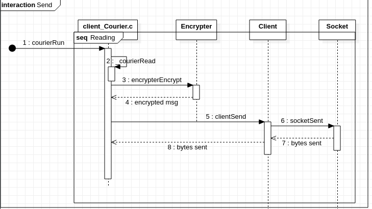
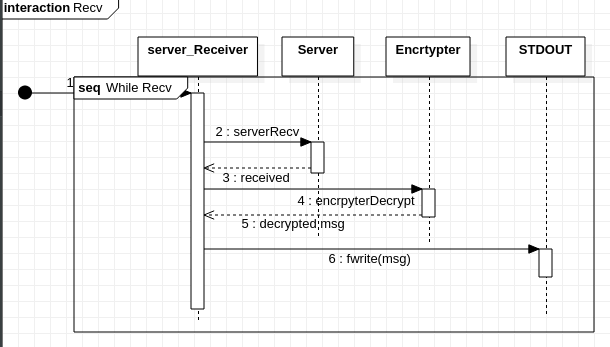
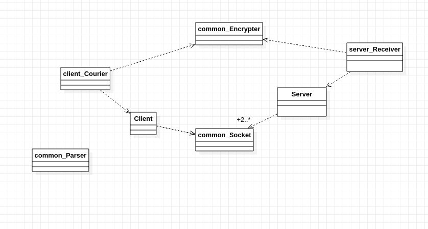

### Alumnos : Nicolas Agustin Riedel

### Padron : 102130

### Repo : https://github.com/RiedelNicolas/7542-Crypto-Sockets

## TP1-Crypto-Sockets

## Envio de un  mensaje:

Se parte de que se pudo establecer una conexion valida entre el cliente y el servidor. (Mediante los TDAS Receiver y Courier ).

Courier lee chunks de 64 bytes de STDIN, los encripta mediante el metodo indicado y los envia hacia el otro proceso hasta que se encuentra con la señal EOF.

###  Recepcion de un mensaje

Se parte de que se pudo establecer una conexcion valida.

El servidor Recibe hasta chunks de 64 bytes mediante el socket previamente bindeado, los descifra y muestra por pantalla.

### Relacion entre TDAS.

#### 2 cosas son muy llamativas.

1. Todos los TDAS tiene relacion de dependencia con otros, la razon que me llevo a hacer esto es a no poder usar herencia o similares en C.
2. Common_Parser quedo aislado, esto es porque se llama en lo respectivos mains y no tiene interaccion con los otros TDAS. Probablemente algo este mal pensado.